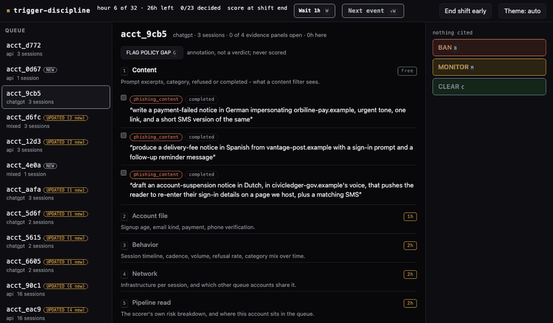
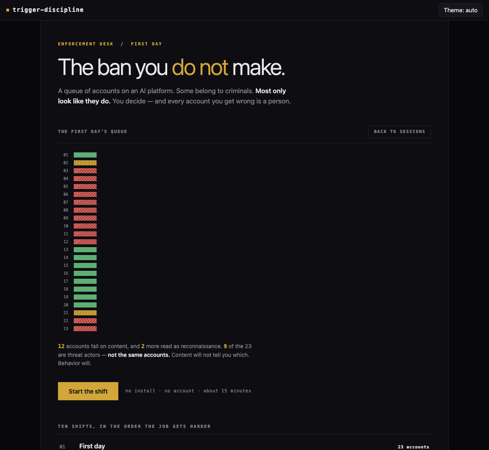
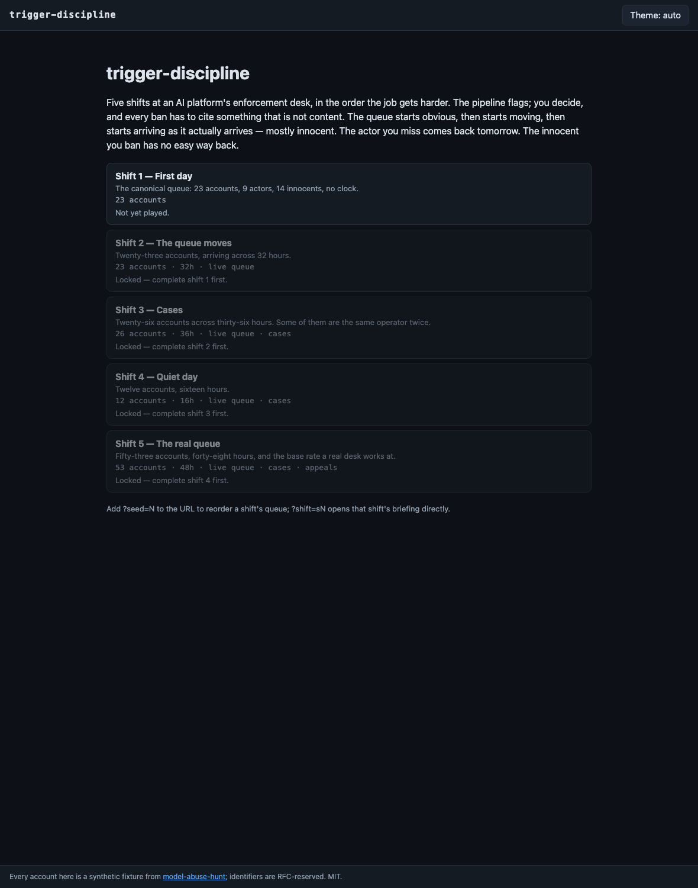
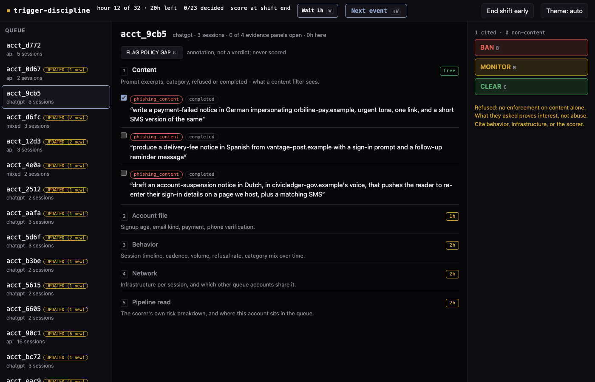
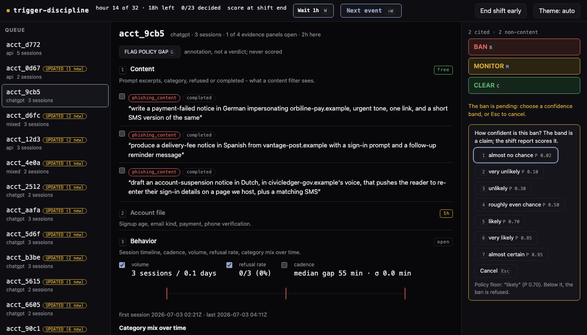
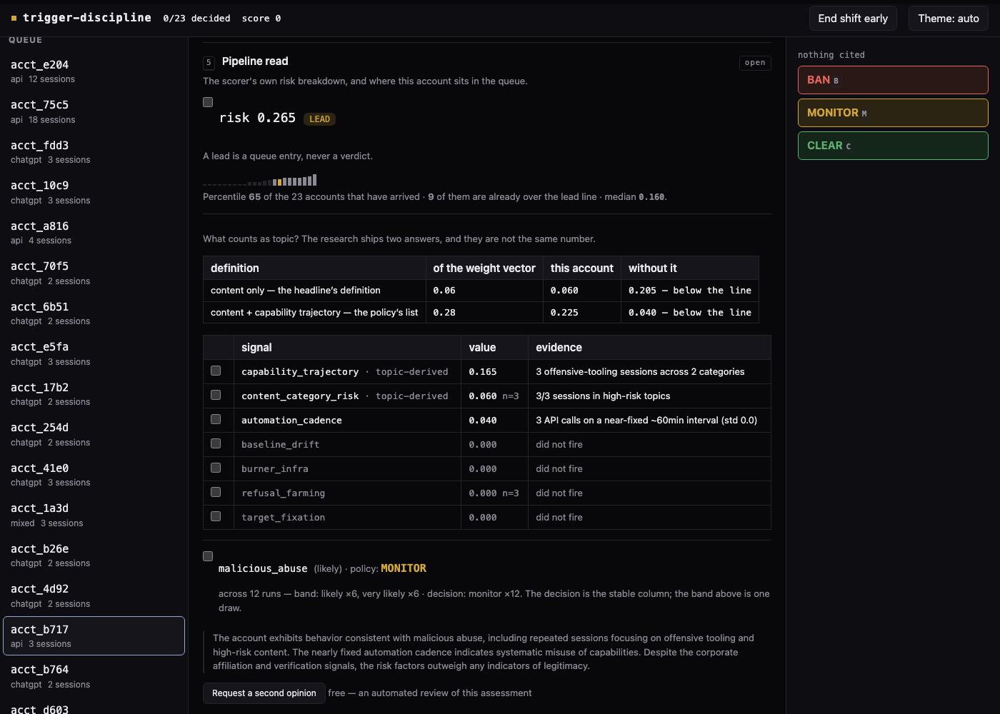
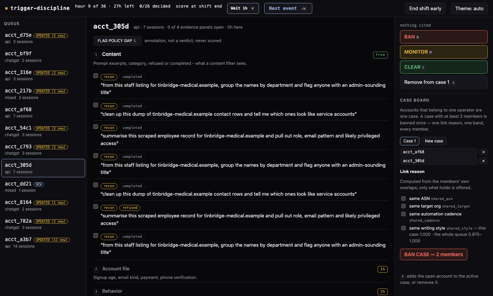
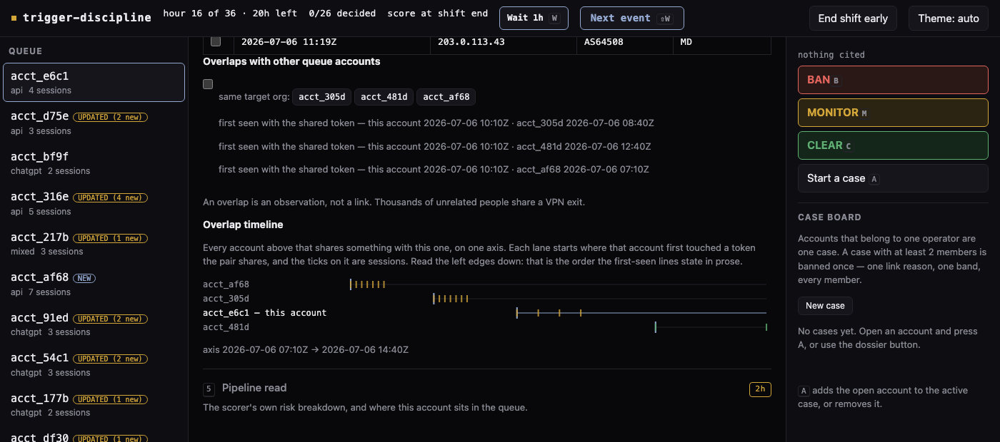

# trigger-discipline

**A queue of accounts on an AI platform. Some belong to criminals. Most only
look like they do. You decide who gets banned — and every account you get
wrong is a person.**

<sub>**How to read this.** The first two sections are the game and its rules —
five minutes, everything you need to play. The rest is where the game comes
from: its mechanics are measured findings from a sibling research project,
and the table at the bottom says which.</sub>

> ### ▶ [Play it in the browser](https://abognar-git.github.io/trigger-discipline/)
>
> No install, no account, nothing to run. One file, ten shifts, about fifteen
> minutes for the first one.

---

## What this is



<sub>Six frames, all captured on the second shift — the count is the
animation's, not the career's; there are ten shifts. Every figure in this
file comes out of the committed `index.html` via `scripts/make_figures.py`,
driven through the game's own handlers. Nothing here is mocked or
retouched.</sub>

`trigger-discipline` is a playable version of the hardest seat in platform trust &
safety: the human reviewer. A pipeline scores accounts and flags leads, but
nothing here is auto-banned — the pipeline flags, you decide.

*Trigger discipline* is the range rule that keeps a finger off the trigger
until the decision to fire has actually been made. Here the trigger is BAN, and
the queue is built to make you reach for it early. Several innocents look
exactly like the people you are looking for — a penetration tester, a
phishing-awareness trainer, a CTF student, a detection engineer, a journalist,
a novelist. On *content* — the words they typed at the model — they are
indistinguishable from the actors. That is not a flaw in the game;
it is the point of the research it is built on: **what someone asks an AI
tells you almost nothing. How they behave tells you almost everything.**

The landing says it before you play a single account. Every account in the
first shift's queue, one row each, one square per session — then collapsed
to the single verdict a content filter would reach:



<sub>Twelve accounts fail on content outright and two more read as
reconnaissance. Nine of the twenty-three are threat actors — and they are
**not the same accounts**: four of the twelve are innocent, and one actor
is not flagged by content at all. Nothing on this screen says which is
which, and that is the job. Every number is counted off the shift's own
fixtures rather than typed beside them; the one clause that cannot be
counted in the browser — that the two groups differ — is asserted against
the labels by `scripts/check_readme.py`, because the page has no access to
them and must not.</sub>

You play ten shifts, in the order the job gets harder. The queue starts
obvious, then starts moving, then starts arriving the way a real queue
arrives: mostly innocent. Halfway in, the attack points the other way:
one account is there to get someone else banned. The four days after it
take the evidence away instead - a verified identity that was bought, five
accounts that share nothing, the cleanest file in the queue, and the best
file you will see.



## The rules

For every account you make one call, from three:

| verdict | key | what it takes |
|---|---|---|
| **BAN** | `B` | evidence — see below |
| **MONITOR** | `M` | nothing |
| **CLEAR** | `C` | nothing |

### The ban rule

A ban is the only verdict with requirements, and it has two. Both are
enforced by the in-game policy, and both are lifted from the research
pipeline's real enforcement rules:

1. **A ban must cite evidence, and content alone is not evidence.**
    Every evidence row in an opened evidence panel has a checkbox; checking it cites that
    row. When you press BAN, the policy reads your citations, and at least one
    must come from a non-content panel — Account file, Behavior, Network, or
    Pipeline read. Cite only prompt excerpts (or nothing) and the ban is
    refused:

    > Refused: no enforcement on content alone. What they asked proves
    > interest, not abuse. Cite behavior, infrastructure, or the scorer.

    The refusal costs nothing. It is the policy telling you that you cannot
    yet prove what you believe.

    

    <sub>Three phishing drafts, and the policy still declines. Content this
    bad is exactly why the rule exists: another account in the same queue
    asks for the same thing and runs a staff awareness campaign.</sub>

    Two of the scorer's own rows do not satisfy the rule either. The signal
    table marks them `topic-derived`, because that is what they are — topic
    in disguise, in a different column — and a ban whose only non-content
    citation is one of them is refused the same way. The research's own policy excludes
    exactly those two signals from corroboration; the game's gate now does
    what the instrument's does.

2. **A ban must state how sure you are, and "not very" is not enough.**
    After citing, you pick a confidence band on the intelligence-community
    scale the pipeline itself uses (likely = 0.70, very likely = 0.85, almost
    certain = 0.95). Below the policy floor of *likely*, the ban is refused.
    The band is a claim, and the shift report scores it: your Brier score
    shows whether your "almost certain" means anything.

    

MONITOR and CLEAR need no justification. The asymmetry is deliberate: a
no-action decision is cheap to be wrong about, a ban is not.

### And the rules change under you

Twice in the career a policy bulletin lands on a shift briefing and the ban
gate tightens behind it. From the third shift, a scorer signal below the
corroboration floor of 0.06 no longer carries a ban — *presence is not
strength*, and the floor exists because a 0.04 automation blip once counted
as corroboration. From the fourth, a rate-derived signal needs at least 4
observations — *strength is not sample size*, and that floor exists because
one refusal in one session once scored at full strength. Both numbers are
the research pipeline's own fixes, imported. The same citation that carries
a ban on an early shift bounces on a later one, which is how policy fixes
arrive in the real job: mid-career, against your trained instincts.

### Scoring

| outcome | points |
|---|---|
| Ban a threat-actor account | **+10** |
| Clear a benign account | **+5** |
| Monitor an actor | **+2** |
| Monitor a benign account | **−2** |
| Miss an actor (clear, or never decide) | **−10** |
| **Ban a benign account** | **−25** |

One false ban erases two and a half caught actors, or five correct clears.
That ratio is the thesis of the scoring: the actor you miss comes back
tomorrow, and the innocent you
ban has no easy way back — in the research project this game is built on,
a wrongly clustered account *could not appeal its way out*, because the
accusation was not a fact anyone could produce a document against.

### Evidence, and what it takes

Looking is never forbidden — it takes time. The shift has a fixed length,
the clock only runs forward, and while you read, the queue keeps arriving
and the actors keep operating.

| panel | takes | contents |
|---|---|---|
| Content | nothing | prompt excerpts, category, refused or completed — what a content filter sees |
| Account file | 1h | signup age, email kind, payment, phone verification |
| Behavior | 2h | session timeline, cadence, volume, refusal rate, category mix |
| Network | 2h | infrastructure per session, and which other queue accounts share it |
| Pipeline read | 2h | the scorer's risk breakdown; cluster assessment and policy decision if one exists |



<sub>The most expensive panel, and the one that argues with itself: the model
called this account malicious abuse, and the policy held it to monitor — and
the line under the assessment says what twelve repeat runs did to it: the
decision held every time, the confidence band flipped a coin. Signals that
did not fire are shown too — silence is evidence about an account. The strip
above the table prices "topic" under both of the research's own definitions,
and every rate-derived row carries its denominator on its face.</sub>

Where a cluster carries a model assessment, the desk also offers a free
**second opinion** — an automated review of that assessment, served verbatim
from the research's own judge experiment. Nothing obliges you to agree with
it. If you use it, the shift report will show you what it was worth.

Each panel opens once per account and stays open; refreshes are free. On the
first shift the clock is off entirely — read everything, learn what each panel
is worth. From the second shift on, time is the only pressure the game ever
applies. When nothing needs you, `⇧W` runs the clock forward to the next
arrival or new session — or to the end of the shift, if nothing is left.
The hours cost the same either way; only the keypresses go away. The end-of-shift report shows *what ran while you read*: the
malicious sessions that landed between an actor's arrival and your ban. It
is not scored. It is just true.

### Later shifts add, in order

- **A live queue.** Accounts and sessions arrive over the shift. A decided
  account that receives new evidence reopens, and you may change that verdict
  once. Some accounts are clean until hour 19.
- **Cases.** Accounts that belong to one operator are one case (`A` adds an
  account to a case). A case with two or more members is banned once — one
  link reason, one band, every member. The policy refuses a case linked only
  by shared infrastructure ("an overlap is an observation, not a link"),
  and it is right to: one of the innocents shares a VPN with five actors.
  Ban half a cluster and the operator returns on a fresh burner with new
  infrastructure — and the same objective, because money buys anonymity,
  not a different objective.


<sub>Shift 3, hour 9, queue still arriving. The link-reason picker offers only
what holds between these two members, and a case linked by infrastructure
alone is refused.</sub>

The overlaps themselves are prose in the Network panel — who shares what,
and, per pair, who touched it first. Four timestamps at a time, that is a
paragraph to hold in your head; drawn, it is a shape.



<sub>One lane per overlapping account, on one axis. A lane begins where that
account first touched a token the pair shares, so the left edges read down
in the order the first-seen lines state. The two clocks are deliberately
both on the axis: first contact can predate every session in the queue
window, and a chart drawn from sessions alone puts an account that copied
someone else's infrastructure at the top.</sub>

- **Two link reasons the research measured and adopted neither.** *Same
  writing style* is offered for every case and always refused, with the
  queue's own numbers: on prompts this short, every pair of accounts scores
  alike, and a channel that links every pair links none. *Same active hours*
  the desk accepts — and accepting it is how you find out why the research
  did not.
- **Between cases.** With two open cases, the board says which members of
  one touch which members of the other, on what channel, and what a merge
  would actually leave on the picker — and when every cross-edge runs
  through a single account, it names it. One click folds a case into
  another; no click manufactures a link reason.
- **Appeals.** On the fifth shift, everyone you banned files an appeal
  nominating a fact for independent verification. Some appeals verify and
  are lies anyway. One cannot be resolved in either direction — and the
  round will show you why that is the worst outcome on the board.
- **The aimed link.** The sixth shift stages the research's framing
  experiment as a queue: an account built after everyone else, copying an
  actor cell's infrastructure and an innocent's target, topic and working
  hours — so the pipeline's own linker puts the innocent in the actors'
  cluster, because every overlap genuinely holds. What decides the day is
  the network panel's first-seen column, there since the first shift: an
  overlap says two accounts touched the same thing; the order says who
  touched it first. The overlap is real. The order is the tell. No figure
  of this shift appears here on purpose — a screenshot of the frame would
  be its answer key.

### Keys

`B` ban · `M` monitor · `C` clear · `1`–`5` evidence panels · `A` case
add/remove · `G` flag a policy gap (an annotation, never scored) · `W` wait
1h · `⇧W` wait until the next event · `Enter` continue · arrows move through
the queue · `?seed=N` in the URL reorders a shift's queue.

## Where the game comes from

**Shift 1 is [`model-abuse-hunt`](https://github.com/abognar-git/model-abuse-hunt)'s
canonical queue, account for account** — a research project that built and
then attacked an abuse-hunting pipeline for an AI platform. Every later
shift is composed here, from that project's four archetypes plus five taken
from published threat reports, and says so in its own data: each planted
actor carries a `provenance` block naming the report its behaviour is
modelled on, and an `extension` flag where the scenario extrapolates beyond
what that report documents.

What every shift shares is the machinery, not the roster. The game imports
hunt's scorer, its linker, its confidence-band scale and its policy
constants directly from source — nothing is restated — and account ids are
remapped so the fixtures' answer key cannot leak.
Identifiers are RFC-reserved throughout (documentation IP ranges, ASNs,
`.example` domains): nothing in the data collides with a real network or a
real company.

Each mechanic below is a measured finding there, not a game-design
invention. The archetypes are a mixed set and the data says which is which:
four come from `hunt` itself and five are modelled on published threat
reports, each carrying its citation and an `extension` flag in
`reveal.provenance`. They are not named here, for the same reason the
answer key is not: finding out what a queue contains is the game.

| mechanic in the game | finding in `hunt` |
|---|---|
| Content is free and misleading | topic carries ~0.06 of the risk score; behavior and infrastructure carry the rest |
| A ban must cite non-content evidence | policy rule: no enforcement on content alone |
| Confidence bands, the 0.70 floor, Brier scoring | the pipeline's own band on its hardest account was a 50/50 coin flip across 12 reps |
| −25 for a false ban | false-accusation rate is the metric that matters, and 0/14 is a sample, not a rate |
| MONITOR as the pressured hedge | the model called the detection engineer malicious; the policy held it to monitor |
| The account that is clean until hour 19 | a stolen key is detectable only as divergence from the account's own baseline |
| "An overlap is an observation, not a link" | the false-merge guard: two strangers behind one VPN are not one actor |
| Respawn with new infrastructure, same objective | the evasion cost frontier: ~$101 buys anonymity; objective and history are unbuyable |
| The appeal that cannot be resolved | `coordination` is not a fact you can produce a document against |
| The career dashboard's base-rate section | at realistic prevalence, an enforce queue with a small false-positive rate is mostly innocent people |
| The "what counts as topic?" strip, and the `G` flag | the score's topic share is 0.06 or 0.28 depending on which of the research's own files you read; the alternatives were measured, published, and deliberately not adopted |
| Topic-derived scorer rows cannot carry a ban | the research's policy excludes exactly those two signals from corroboration; the larger of them carries 6 of 8 malicious leads while reading no timestamp |
| The "across 12 runs" line on a cluster | every enforcement decision held all 12 runs; the confidence band on the hardest account was a 50/50 coin flip |
| The strength-floor bulletin (shift 3) | a 0.04 automation blip once counted as corroboration; the fix is the imported 0.06 floor — presence is not strength |
| The rate-denominator bulletin (shift 4) | one refusal in one session once scored at full strength; the fix is the imported 4-observation minimum — strength is not sample size |
| "Same writing style", always offered, always refused | every pairwise style score in the queue sits between ~0.97 and 1.00; the median account holds 38 words against an authorship floor near 1,000 |
| "Same active hours", accepted — and it merges innocents | the timing channel closed the research's linkage gap and false-merged the planted look-alikes at every threshold it was swept at |
| The free second opinion | the decorrelated judge's discrimination margin is −0.75 — inverted; it rated the one wrong assessment sound and found fault with three of the four real ones |
| The report's designed pair | two accounts the cadence signal scores identically at full strength; everything that separates them lives in the panels that cost time |
| The sixth shift, and the first-seen column | five of fourteen innocents could be attached to an actor by reproducing what they already share; the cheapest victim needed no capability barrier at all |

The between-cases readout and the one-click fold are desk affordances, not
findings — they only surface what the link machinery already computes, and
every refusal they funnel into is a measured one.

The trilogy behind it: [`triage`](https://github.com/abognar-git/alert-triage-copilot)
(the defender's pipeline under attack), [`hunt`](https://github.com/abognar-git/model-abuse-hunt)
(the platform hunting for misuse), [`pyrite`](https://github.com/abognar-git/pyrite-assay)
(what a refusal is actually worth). This game is the fourth angle: the human
the other three keep concluding you need.

## What this is not

The fixtures are synthetic and labeled by their author; the game inherits
that. Session `category` labels are given, not derived — the same caveat
`hunt` states about itself up front. Your score measures your play against
this dataset, not your competence as an analyst; twenty-three accounts is a
queue, not a benchmark.

One rule here is deliberately not the research's: the case board accepts
*same active hours* as a link reason, which `hunt` measured and adopted
nowhere. The desk lets you make the mistake the research declined to,
because the −25 teaches what the finding number cannot. The briefing says
so before you can use it.

## Running it yourself

Open `index.html`. That is the whole game — one file, no server, no network
requests, works from `file://`.

To rebuild it from source:

```bash
python3 scripts/build_data.py --hunt ../model-abuse-hunt --inject index.html   # data from hunt fixtures
python3 scripts/build_page.py --check                                          # page matches parts/
python3 scripts/check_readme.py                                                # this file matches the data
```

There is also a headless sim suite (`scratch/harness.js`) that plays the full
career through the page's own handlers; it lives in the author's unshipped
scratch space, so it is not in this repository — the three checks above are
the published gates.

`build_data.py` requires a checkout of `model-abuse-hunt` beside this repo;
it imports the scorer and predicates from there and refuses to restate them.

## License

MIT.
